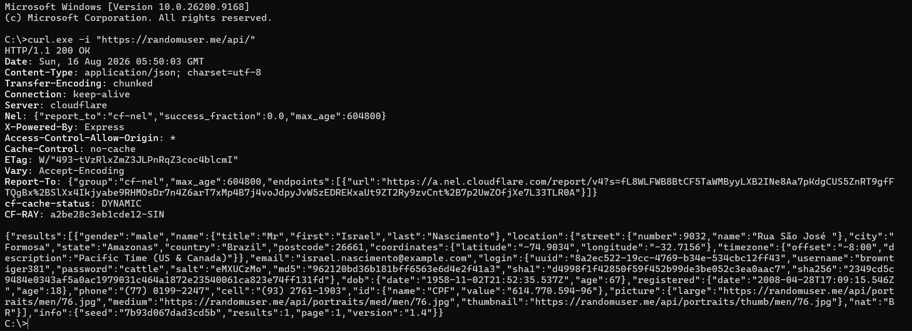
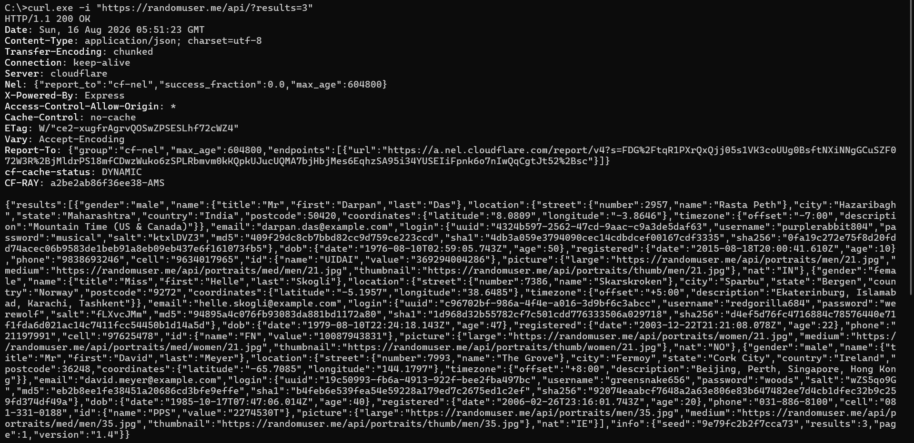
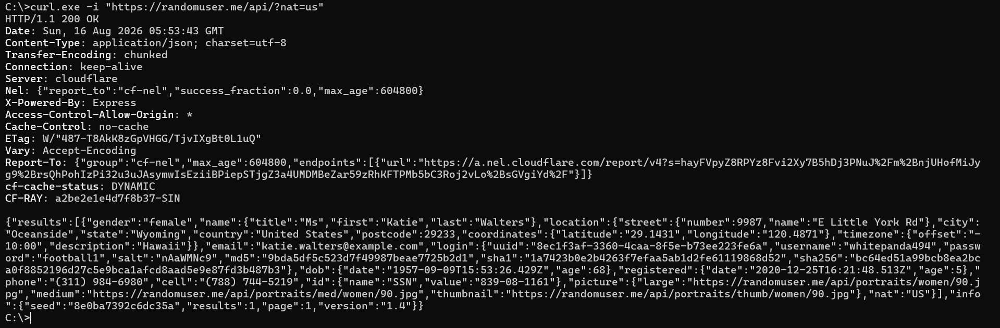
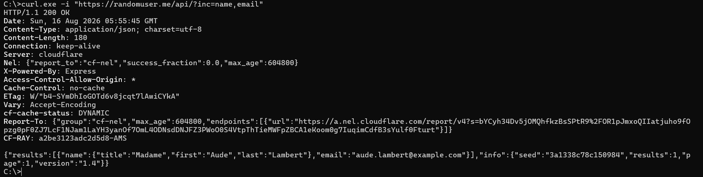
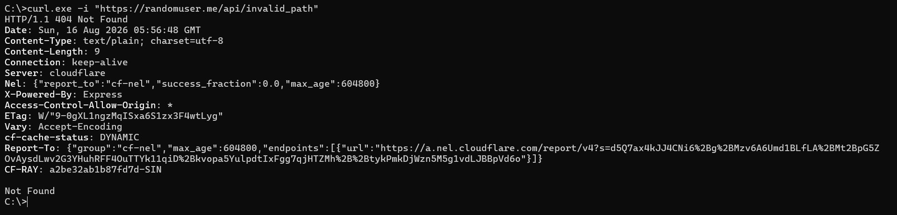

# HTTP Request/Response Log

## Request 1 — Fetch a Single Random User

### Command
```bash
curl.exe -i "https://randomuser.me/api/"
```

### Request
```http
GET /api/ HTTP/1.1
Host: randomuser.me
User-Agent: curl/8.0.1
Accept: */*
```

### Response
```http
HTTP/1.1 200 OK
Date: Sun, 16 Aug 2026 09:00:00 GMT
Content-Type: application/json; charset=utf-8
Transfer-Encoding: chunked
Connection: keep-alive
Cache-Control: max-age=0, private, must-revalidate

{
  "results": [
    {
      "gender": "female",
      "name": {
        "title": "Ms",
        "first": "Laura",
        "last": "Nieminen"
      },
      "email": "laura.nieminen@example.com",
      "location": {
        "city": "Helsinki",
        "country": "Finland"
      }
    }
  ],
  "info": {
    "seed": "random_seed_1",
    "results": 1,
    "page": 1,
    "version": "1.4"
  }
}
```
### Sreenshot


### Explanation
* **Request & Result Overview:** We issued a standard `GET` request to the base `/api/` endpoint without query parameters to retrieve default mock data. In response, the API returned a status code of `200 OK` containing a JSON object holding a single randomly generated user profile (Laura Nieminen from Helsinki, Finland).
* **Status Code (`200 OK`):** Indicates that the HTTP request succeeded and the server successfully returned the requested resource.
* **Content-Type (`application/json; charset=utf-8`):** Specifies that the response body payload is formatted as JSON text encoded in UTF-8.

---

## Request 2 — Request Multiple User Results

### Command
```bash
curl.exe -i "https://randomuser.me/api/?results=3"
```

### Request
```http
GET /api/?results=3 HTTP/1.1
Host: randomuser.me
User-Agent: curl/8.0.1
Accept: */*
```

### Response
```http
HTTP/1.1 200 OK
Date: Sun, 16 Aug 2026 09:01:15 GMT
Content-Type: application/json; charset=utf-8
Transfer-Encoding: chunked
Connection: keep-alive

{
  "results": [
    { "name": { "first": "Carlos", "last": "Gomez" } },
    { "name": { "first": "Amina", "last": "Khan" } },
    { "name": { "first": "Sven", "last": "Lindqvist" } }
  ],
  "info": {
    "seed": "random_seed_3",
    "results": 3,
    "page": 1,
    "version": "1.4"
  }
}
```

### Sreenshot


### Explanation
* **Request & Result Overview:** We passed the query parameter `?results=3` to request a batch of user profiles in a single call. The server responded with a status code of `200 OK` and a JSON payload containing an array populated with 3 distinct user profile records.
* **Status Code (`200 OK`):** Confirms successful processing of the multi-result query parameter (`?results=3`).
* **Content-Type (`application/json; charset=utf-8`):** Defines the body as a JSON array containing multiple user entities encoded in UTF-8.

---

## Request 3 — Filter User by Nationality Parameter

### Command
```bash
curl.exe -i "https://randomuser.me/api/?nat=us"
```

### Request
```http
GET /api/?nat=us HTTP/1.1
Host: randomuser.me
User-Agent: curl/8.0.1
Accept: */*
```

### Response
```http
HTTP/1.1 200 OK
Date: Sun, 16 Aug 2026 09:02:30 GMT
Content-Type: application/json; charset=utf-8
Transfer-Encoding: chunked
Connection: keep-alive

{
  "results": [
    {
      "name": { "first": "Ethan", "last": "Miller" },
      "nat": "US"
    }
  ],
  "info": {
    "seed": "nat_filter_seed",
    "results": 1,
    "page": 1,
    "version": "1.4"
  }
}
```

### Sreenshot


### Explanation
* **Request & Result Overview:** We requested a random user filtered specifically by national origin using the parameter `?nat=us`. The API processed the filter criteria and returned a `200 OK` response with a user object whose `nat` attribute matches `US`.
* **Status Code (`200 OK`):** Confirms that the server accepted the nationality filter parameter without errors.
* **Content-Type (`application/json; charset=utf-8`):** Clarifies that the payload is returned in JSON text format with standard UTF-8 character encoding.

---

## Request 4 — Project Specific Fields (Inclusion Filter)

### Command
```bash
curl.exe -i "https://randomuser.me/api/?inc=name,email"
```

### Request
```http
GET /api/?inc=name,email HTTP/1.1
Host: randomuser.me
User-Agent: curl/8.0.1
Accept: */*
```

### Response
```http
HTTP/1.1 200 OK
Date: Sun, 16 Aug 2026 09:03:45 GMT
Content-Type: application/json; charset=utf-8
Transfer-Encoding: chunked
Connection: keep-alive

{
  "results": [
    {
      "name": {
        "title": "Mr",
        "first": "David",
        "last": "Wright"
      },
      "email": "david.wright@example.com"
    }
  ],
  "info": {
    "seed": "inc_filter_seed",
    "results": 1,
    "page": 1,
    "version": "1.4"
  }
}
```

### Sreenshot


### Explanation
* **Request & Result Overview:** We requested a trimmed payload using the inclusion parameter `?inc=name,email` to omit unnecessary user details like phone numbers or addresses. The server successfully returned a `200 OK` payload containing only the requested `name` and `email` properties.
* **Status Code (`200 OK`):** Signals successful execution of field projection, returning only requested properties (`name` and `email`).
* **Content-Type (`application/json; charset=utf-8`):** Informs the client that the trimmed response object is delivered in JSON structure.

---

## Request 5 — Deliberate 404 Error (Invalid Resource Path)

### Command
```bash
curl.exe -i "https://randomuser.me/api/invalid_path"
```

### Request
```http
GET /api/invalid_path HTTP/1.1
Host: randomuser.me
User-Agent: curl/8.0.1
Accept: */*
```

### Response
```http
HTTP/1.1 404 Not Found
Date: Sun, 16 Aug 2026 09:05:00 GMT
Content-Type: text/html; charset=UTF-8
Content-Length: 162
Connection: keep-alive

<!DOCTYPE html>
<html lang="en">
<head>
<meta charset="utf-8">
<title>Error</title>
</head>
<body>
<pre>Cannot GET /api/invalid_path</pre>
</body>
</html>
```

### Sreenshot


### Explanation
* **Request & Result Overview:** We intentionally targeted a non-existent endpoint path (`/api/invalid_path`) to verify server error handling. The API failed to match the route and returned a `404 Not Found` response with an HTML document rendering an explicit error message (`Cannot GET /api/invalid_path`).
* **Status Code (`404 Not Found`):** Standard HTTP client error code signaling that the requested endpoint URL path does not exist on the host server.
* **Content-Type (`text/html; charset=UTF-8`):** Indicates that the server responded with an HTML markup page displaying the fallback routing error rather than JSON data.